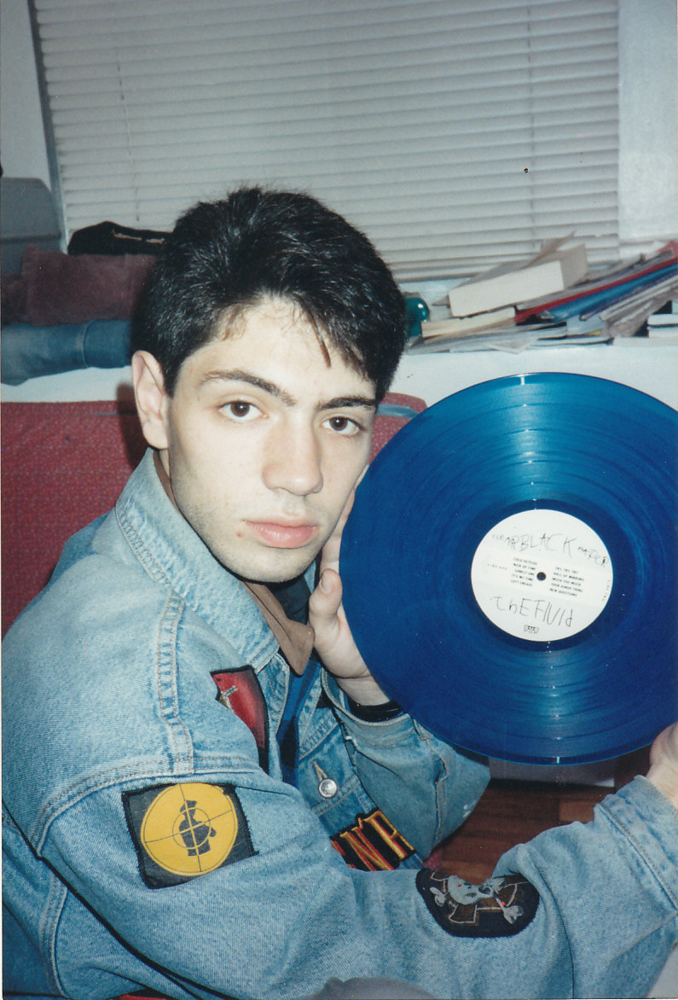

<!-- This won't be displayed but it will initialize your R session. Add any R libraries you need here. -->
```{r init,include=FALSE,echo=FALSE}
library(magrittr)
readLines('https://www.zotero.org/api/users/4689565/collections/P5AYB86B/items/top?start=0&limit=25&format=bibtex&itemKey=QIEJHK3I%2CJUHVCV6K%2CQLS2UWPC%2C7RYRA2NY%2CUNTJKXQ4%2CZVFLBWHR%2CKXZ8M7YC%2CBFR56DQ2&key=BIGHhSXREPzsDa8sNCom0Odq&v=1') %>% writeLines('references.bib')
```


# Welcome!

<!-- You can include images saved within your repo... -->
```{r hello-world,echo=FALSE,fig.cap='1994: One of John\'s earliest rare record finds.',fig.align='center',out.width='50%'}

```


<!-- Below this line is just examples of how you can embed video from Google Drive. First you have to enable sharing, then just get the object ID which is that long string between d/ and /preview and will also be appended to any sharing link you generate for your video. -->
<p>
```{r hello-john,echo=FALSE,fig.cap='John Pette Introduction',fig.align='center'}
knitr::include_url('https://drive.google.com/file/d/1ymBBd8MuHF49uFaln_gM9t-K5esLxRMP/preview')
```

### Beyond Spotify: Harnessing the Human Element of Music Recommendations

(ref:abs1) Music recommendation algorithms have been ubiquitous for many years, but still miss the mark with great regularity. They also fail to tap into the potential of the passive consumer market. Artists, music apps, and record labels are not capitalizing on this income, and that represents an opportunity. My approach will identify artist links that go beyond music-based algorithms and use available data from social media and music sales platforms, such as Bandcamp and Discogs, to identify unconventional links between artists. I will deliver recommendations and curated playlists to end users through an app. Passive users will not have to take any action to have novel music discoveries delivered to them.

(ref:abs1)

### Projecting Long-term Value of Collectible Vinyl Records

(ref:abs2) Vinyl records are a huge industry, and the market is packed with collectors of all ages competing for rare items. What if there were an app that could project the long-term value of these collectibles and optimize value for collectors and dealers? My hypothesis is that there is a predictable lifecycle in the value of collectibles, and data can help reveal those trends. By examining sales records over time from the two most extensive music markets on Earth, eBay and Discogs, we can begin to understand what collectors instinctively know: that there are good times to buy and sell collectibles. 

(ref:abs2)

## About the author

I am a recovering U.S. diplomat. I have worked in management and operations as a Foreign Service Officer for the U.S. Department of State since 2005. I am currently the Program Manager for a $100+ million transformational initiative to overhaul the State Department's data management processes related to facilities. I have served in Washington, DC, Switzerland, and El Salvador. Prior to that, I was a research chemist, a radio DJ, and an IT Manager. I love numbers and am at my professional best when I am able to extract the meaning behind them. I decided to embrace this tendency as my true calling, and have followed that path into the UC Berkeley MIDS program. I am originally from New York, but lived in Tokyo, Japan, for most of my formative years. My wife, Kat, and I are relocating from Washington, DC, to the Bay Area in May 2018.

*Updated: `r Sys.Date()`*
